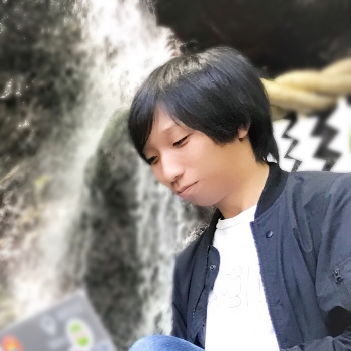

## 松館 大輝 / Daiki Matsudate

- iOSアプリの開発
- 技術記事の翻訳
- 技術コミュニティの勉強会の主催/運営

## SNS

- [Twitter @d_date](https://twitter.com/d_date)
- [Facebook - Daiki Matsudate](https://www.facebook.com/matsudate.daiki)
- [GitHub - @d-date](https://github.com/d-date)

## 記事 / publication

#### [Realm News](https://realm.io/jp/news/)
Realm Newsにはモバイルアプリ開発やその周辺技術に関するトピックが記事として配信されており、その翻訳を一部請け負っています。カンファレンスでのトークの書き起こしなど、日本語で配信されることが少ないトピックが配信される記事媒体となっており、日本のアプリ開発者の注目も高いです。

#### [Medium](https://medium.com/@d_date)
自身のブログを立てる代わりに、Mediumに投稿しています。

#### [Qiita](http://qiita.com/d_date)

業務上必要になった知識(公開情報に限る)や、勉強会でのまとめ記事を投稿しています。

一番人気の記事は、Swift4の情報のキャッチアップが世の中的に進んでない中書いた、こちらの記事です。

- [Swift4で何が変わりそうなのか](http://qiita.com/d_date/items/b3562f542afc306791ce)

## LT

* [Speaker Deck](https://speakerdeck.com/d_date)

## Meetup

#### [try!Swift TOKYO 2018] (https://www.tryswift.co/tokyo/jp) / Organizer

2018年3月に開催される Swift の国際カンファレンスです。今年はがっつり関わっています。

#### [Creators Learning English Meetup](https://clem.connpass.com/) / Core Staff

英語をがんばりたいエンジニアやデザイナーが集まって、知見を共有しあうミートアップです。LT枠の他に、実際に英語を使って仕事をしている方をゲストとしてお招きしています。

会の雰囲気は何度かブログにまとめています。

- [普段はiOSエンジニアの方が英語の話をするとすごかった](https://medium.com/@d_date/bd5ddd06fb21)
- [CfPを出して、カンファレンスで登壇しよう](https://medium.com/@d_date/ebfb78d24945)

#### [try!Swift TOKYO 2017](https://www.tryswift.co/tokyo/jp) / Staff

2017年3月に新宿で開催された、Swiftの国際カンファレンスです。

try!Swiftで何をしてきたかは、記事にまとめました。 [カンファレンスを120%楽しむ方法、あるいは次回に向けて](https://medium.com/@d_date/9a19f9ba0c1e)

現在、[2018年](https://www.tryswift.co/events/2018/tokyo/en/)の開催に向け、Organizerの一人として活動しています。

#### [fastlane勉強会](https://fastlane.connpass.com/) / Core Staff

[fastlane](https://fastlane.tools/)というiOS/Androidでよく使われるCLIツールに関する勉強会です。fastlaneを使うことで、アプリのデプロイ作業を自動化するなど、コーディング以外の手間のかかる部分を自動化したり、CIと連携してテスト版アプリの自動配信を行うことができます。fastlaneの製作者であるFelix Krauseとも交流があります。
